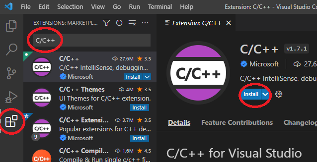
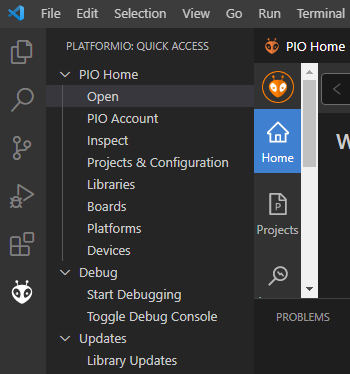
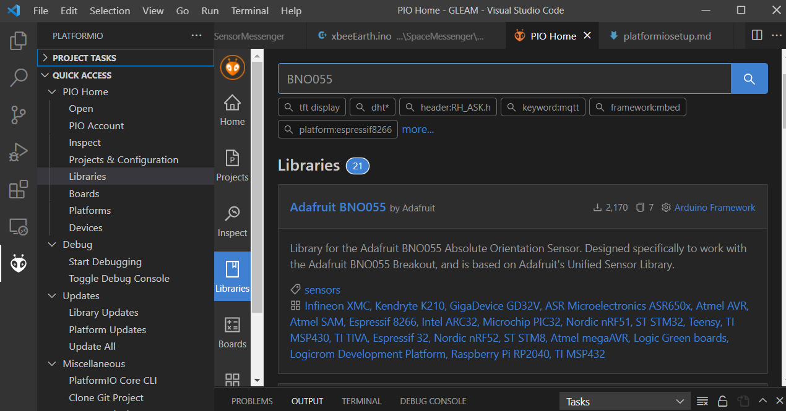

# Setting up platformIO

### Why PlatformIO
* Being able to use Visual Studio Code, which is an actual IDE, has a number of significant benefits that make software development overall easier and faster to iterate.

### Installing
1. Install Visual Studio Code https://code.visualstudio.com/
2. Once installed, open Visual Studio Code
Install the `C/C++` and `PlatformIO` extension

Example installing extension:

You'll now see a little icon at the bottom left for PlatformIO

This is where you can open PlatformIO projects, create new ones, install libraries, etc.

## Installing Libraries
The libraries used by platformIO are seperate from the Arduino library, however most of the libararies available in Arduino are available in PlatformIO.

In the above PlatformIO menu you can use the `Libraries` option and search for your library, it will show the author.

## Compiling and Uploading
At the bottom of VSC you'll see these options, hover over them and it will tell you their function.

